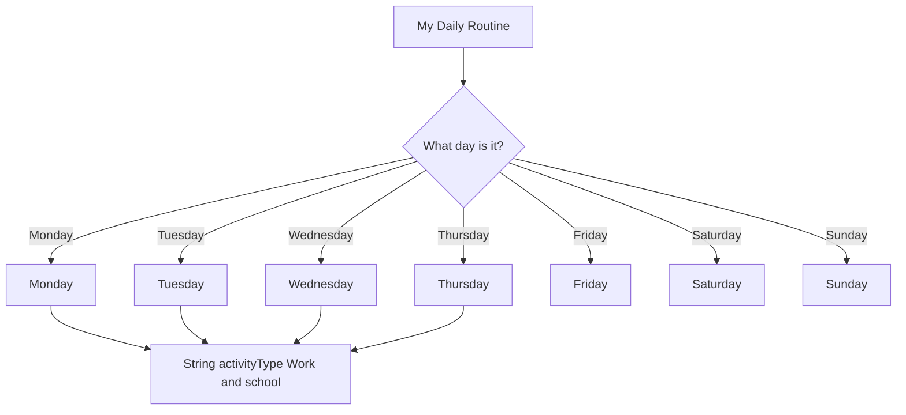

classDiagram

DayOfTheWeek <|--Monday
DayOfTheWeek <|--Tuesday
DayOfTheWeek <|--Wednesday
DayOfTheWeek <|--Thursday
DayOfTheWeek <|--Friday
DayOfTheWeek <|--Saturday
DayOfTheWeek <|--Sunday

class Monday{
    String clothingType Comfortable and Cute
    int energyLevel 5
    changeEnergy(String prevEnergy String newEnergy)
    activity(String work String school)
}

class Tuesday{
    String clothingType Comfortable and Cute
    int energyLevel 4
    changeEnergy(String prevEnergy String newEnergy)
    activity(String work String school)
}

class Wednesday{
    String clothingType Comfortable and Cute
    int energyLevel 3
    changeEnergy(String prevEnergy String newEnergy)
    activity(String work String school String meetings)
}

class Thursday{
    String clothingType Comfortable and Cute
    int energyLevel 2
    changeEnergy(String prevEnergy String newEnergy)
    activity(String work String school String meetings)
}

class Friday{
    String clothingType Comfortable
    int energyLevel 1
    changeEnergy(String prevEnergy String newEnergy)
    activity(String homework)
}

class Saturday{
    String clothingType Comfortable
    int energyLevel 3
    changeEnergy(String prevEnergy String newEnergy)
    activity(String homework)
}

class Sunday{
    String clothingType Cute
    int energyLevel 4
    changeEnergy(String prevEnergy String newEnergy)
    activity(String Day off, time to have fun!)
}